# Laporan Hasil: Klasifikasi Aksara Jawa (Hanacaraka) dengan CNN

## 1. Latar Belakang

Aksara Jawa atau *Hanacaraka* adalah sistem tulisan tradisional yang telah digunakan selama berabad-abad untuk menulis bahasa Jawa. Terdapat 20 karakter dasar (*carakan*) yang membentuk fondasi sistem penulisan ini:

```
ha  na  ca  ra  ka
da  ta  sa  wa  la
pa  dha ja  ya  nya
ma  ga  ba  tha nga
```

Pelestarian aksara ini menghadapi tantangan serius di era digital. Digitalisasi naskah dan dokumen aksara Jawa memerlukan kemampuan pengenalan karakter otomatis (OCR) yang andal. Namun, klasifikasi tulisan tangan aksara Jawa secara otomatis memiliki beberapa tantangan:

1. **Kemiripan visual tinggi**: Beberapa pasangan karakter sangat mirip secara visual (misalnya `ha` vs `na`, `la` vs `wa`, `da` vs `dha`).
2. **Variasi tulisan tangan**: Setiap penulis memiliki gaya yang berbeda, menghasilkan variasi bentuk yang signifikan untuk karakter yang sama.
3. **Stroke tipis**: Karakteristik stroke aksara Jawa yang halus rentan hilang atau terdistorsi saat resize gambar ke resolusi yang lebih kecil.
4. **Dataset terbatas**: Corpus digital aksara Jawa tulisan tangan masih sangat terbatas dibanding aksara Latin.

Proyek ini bertujuan membangun sistem klasifikasi otomatis berbasis CNN (*Convolutional Neural Network*) yang mampu mengenali ke-20 karakter Hanacaraka dari gambar tulisan tangan dengan akurasi tinggi.

---

## 2. Novelty dan Kontribusi

### 2.1 Pipeline Reprodusibel Berbasis CLI

Berbeda dari pendekatan notebook yang umum digunakan, proyek ini mengimplementasikan pipeline end-to-end berbasis command-line (`main.py`) yang mendukung mode `eda`, `train`, `eval`, `gradcam`, dan `all`. Pendekatan ini memastikan reprodusibilitas penuh: seed global di-set secara deterministik, semua output disimpan terstruktur di folder `outputs/`.

### 2.2 Preprocessing Domain-Specific untuk Aksara Tulisan Tangan

Pipeline preprocessing dirancang khusus untuk karakteristik aksara Jawa tulisan tangan:

- **AutoContrast dengan cutoff**: Memperkuat kontras stroke tipis sebelum resize, mencegah hilangnya detail stroke yang merupakan fitur diskriminatif utama.
- **Invert (background hitam, stroke putih)**: Stroke menjadi "fitur positif" yang di-amplifikasi oleh ReLU, menghasilkan aktivasi lebih kuat pada area diskriminatif.
- **Square Padding**: Mempertahankan aspect ratio sebelum resize. Tanpa ini, karakter landscape akan ter-squish dan distorsi stroke mengacaukan fitur.

### 2.3 Augmentasi Domain-Aware

Augmentasi dipilih berdasarkan sifat fisik aksara Jawa:

- `RandomAffine` (rotasi, translasi, scale, shear): Mensimulasikan variasi cara menulis natural.
- `ColorJitter` (brightness, contrast): Menangani variasi ketebalan stroke dan kualitas scan.
- `RandomErasing`: Membuat model invariant terhadap oklusi parsial, belajar dari seluruh karakter bukan satu stroke dominan.
- **Tanpa flip horizontal/vertikal**: Aksara Jawa tidak simetris; flip menghasilkan karakter yang semantiknya berbeda atau tidak valid.

### 2.4 Arsitektur ImprovedCNN dengan Two-Layer FC Head

Penambahan hidden layer 256 -> 128 -> 20 dengan BatchNorm1d memberikan ruang untuk pembentukan representasi intermediate sebelum keputusan klasifikasi. Dropout berlapis (0.4 sebelum FC1, 0.2 sebelum FC2) memberikan regularisasi proporsional dengan posisi dalam jaringan.

### 2.5 Grad-CAM untuk Interpretabilitas

Implementasi Grad-CAM memungkinkan visualisasi bagian gambar yang paling berpengaruh terhadap prediksi. Ini penting untuk verifikasi bahwa model benar-benar belajar dari stroke aksara (bukan artefak background atau noise), dan untuk mengidentifikasi kelemahan model pada pasangan kelas yang sering tertukar.

### 2.6 Pendekatan From-Scratch sebagai Alternatif terhadap Pretrained Model

Sebagian besar penelitian klasifikasi aksara Jawa yang ada mengandalkan model pretrained seperti ResNet atau VGG yang dilatih pada ImageNet sebagai titik awal. Pendekatan tersebut memang menghasilkan akurasi tinggi, namun menciptakan ketergantungan pada representasi fitur domain yang berbeda secara fundamental dari aksara tulisan tangan. Proyek ini secara sadar memilih untuk melatih model dari nol (*from scratch*) dengan arsitektur yang dirancang khusus, membuktikan bahwa CNN dengan ~400K parameter yang dilengkapi preprocessing domain-specific dan regularisasi berlapis mampu mencapai performa yang kompetitif tanpa bergantung pada bobot pretrained eksternal.

### 2.7 Evaluasi Lintas Domain untuk Estimasi Generalisasi yang Lebih Robust

Berbeda dari penelitian yang hanya mengevaluasi model pada satu sumber data yang homogen, proyek ini memanfaatkan dua sumber dataset dengan karakteristik berbeda: gambar tulisan tangan in-distribution dari GitHub vzrenggamani dan gambar hasil cropping bounding box dari Roboflow. Strategi evaluasi dengan data dari distribusi yang berbeda ini memberikan estimasi generalisasi yang lebih realistis dan robust dibandingkan evaluasi single-domain, karena model diuji pada variasi kondisi akuisisi gambar yang mencerminkan penggunaan nyata sistem OCR aksara Jawa.

### 2.8 Target Akurasi Kompetitif dengan Model Pretrained

Proyek ini menetapkan target akurasi minimal **85%** pada test set sebagai ambang batas keberhasilan. Target ini dipilih secara strategis agar hasil yang diperoleh dari model *from scratch* ~400K parameter dapat diperbandingkan secara bermakna dengan pendekatan berbasis pretrained yang umumnya beroperasi di rentang 88-95% pada dataset serupa. Dengan kedua model (SimpleCNN dan ImprovedCNN) berhasil melampaui target ini pada akurasi 87.50%, penelitian ini menunjukkan bahwa gap performa antara model *from scratch* yang dirancang dengan tepat dan model pretrained tidak sebesar yang sering diasumsikan untuk domain aksara tulisan tangan dengan jumlah kelas terbatas.

---

## 3. Flowchart Pipeline

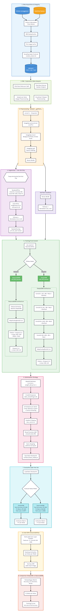

---

## 4. Metodologi

### 4.1 Dataset

| Split | Jumlah Gambar | Sumber |
|-------|--------------|--------|
| Train | 3,898 | GitHub vzrenggamani (70%) |
| Val   | 836   | GitHub vzrenggamani (15%) |
| Test  | 848   | GitHub vzrenggamani (15%) |
| **Total** | **5,582** | |

**Sumber Data:**
- **GitHub vzrenggamani** (`aksarajawa-hanacaraka`): Sumber utama gambar tulisan tangan in-distribution.
- **Roboflow fawwaz** (opsional): Dataset object-detection yang di-crop per bounding box.

**Strategi Split:**
- Stratified split 70/15/15 menggunakan `sklearn.model_selection.train_test_split` dengan `random_state=42`.
- Deduplication berbasis MD5 hash mencegah kebocoran data antar split.
- Validasi integritas setiap gambar via `PIL.Image.verify()`.

### 4.2 Preprocessing

Dieksekusi per-gambar di dalam `AksaraJawaDataset.__getitem__`:

| Tahap | Operasi | Tujuan |
|-------|---------|--------|
| 1 | `convert("L")` | Grayscale: warna tidak informatif untuk handwriting |
| 2 | `ImageOps.autocontrast(cutoff=2)` | Stretch dynamic range, perkuat stroke tipis |
| 3 | `ImageOps.invert()` | Background hitam, stroke putih |
| 4 | `ImageOps.pad(square, color=0)` | Preserve aspect ratio |
| 5 | `Resize(96x96)` | Input standar model |
| 6 | `ToTensor() + Normalize(0.10, 0.25)` | Normalisasi distribusi |

### 4.3 Arsitektur Model

**SimpleCNN (Baseline):**

```
Input: (B, 1, 96, 96)
Block 1: Conv2d(1->32, 3x3, pad=1) -> BN -> ReLU -> MaxPool(2)  -> (B, 32, 48, 48)
Block 2: Conv2d(32->64)             -> BN -> ReLU -> MaxPool(2)  -> (B, 64, 24, 24)
Block 3: Conv2d(64->128)            -> BN -> ReLU -> MaxPool(2)  -> (B, 128, 12, 12)
Block 4: Conv2d(128->256)           -> BN -> ReLU                -> (B, 256, 12, 12)
         AdaptiveAvgPool2d(1)                                    -> (B, 256, 1, 1)
Classifier: Flatten -> Dropout(0.3) -> Linear(256, 20)
Total Parameters: 393,460
```

**ImprovedCNN:**

```
[Feature extraction identik dengan SimpleCNN]
Classifier:
  Flatten -> Dropout(0.4) -> Linear(256, 128) -> BN1d(128) -> ReLU
  -> Dropout(0.2) -> Linear(128, 20)
Total Parameters: 424,052
```

### 4.4 Strategi Training

| Komponen | Pilihan | Nilai |
|----------|---------|-------|
| Optimizer | AdamW | lr=1.2e-3, weight_decay=1e-4 |
| Loss | CrossEntropyLoss | label_smoothing=0.05 |
| LR Scheduler | Linear Warmup + Cosine Annealing | warmup=2 epoch |
| Gradient Clipping | `clip_grad_norm_` | max_norm=1.0 |
| Early Stopping | Patience | 12 epoch tanpa peningkatan val_acc |
| Mixed Precision | AMP | Aktif otomatis jika GPU tersedia |
| Max Epochs | | 50 |

**Label Smoothing (ε=0.05):** Label `[1, 0, ..., 0]` diubah menjadi `[0.9525, 0.0025, ...]` untuk mencegah overconfidence pada kelas mudah dan meningkatkan generalisasi pada kelas sulit.

**LR Scheduler per-batch:** Warmup berjalan benar di epoch pertama; jika di-step per-epoch, epoch pertama dilatih dengan LR=0.

---

## 5. Hasil Eksperimen

### 5.1 Training Curves

**SimpleCNN:**

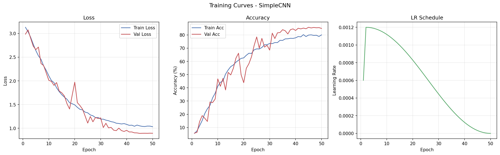

**ImprovedCNN:**

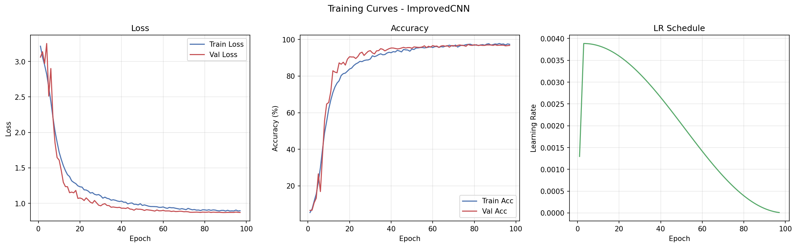

**Perbandingan Training:**

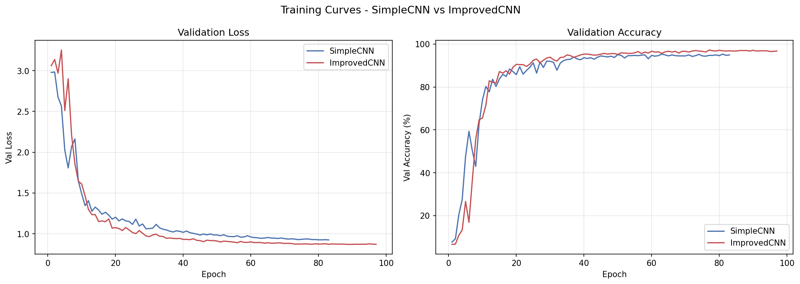

### 5.2 Perbandingan SimpleCNN vs ImprovedCNN

| Metrik | SimpleCNN (Baseline) | ImprovedCNN |
|--------|---------------------|-------------|
| Test Accuracy | 87.50% | 87.50% |
| F1 Macro | 87.03% | 86.95% |
| F1 Weighted | 87.44% | 87.32% |
| Precision Macro | 87.41% | 87.40% |
| Recall Macro | 87.01% | 87.01% |
| Test Loss | 0.5977 | 0.4866 |
| Best Val Accuracy | 85.77% | 86.00% |
| Total Parameters | 393,460 | 424,052 |
| Total Epochs | 50 | 50 |

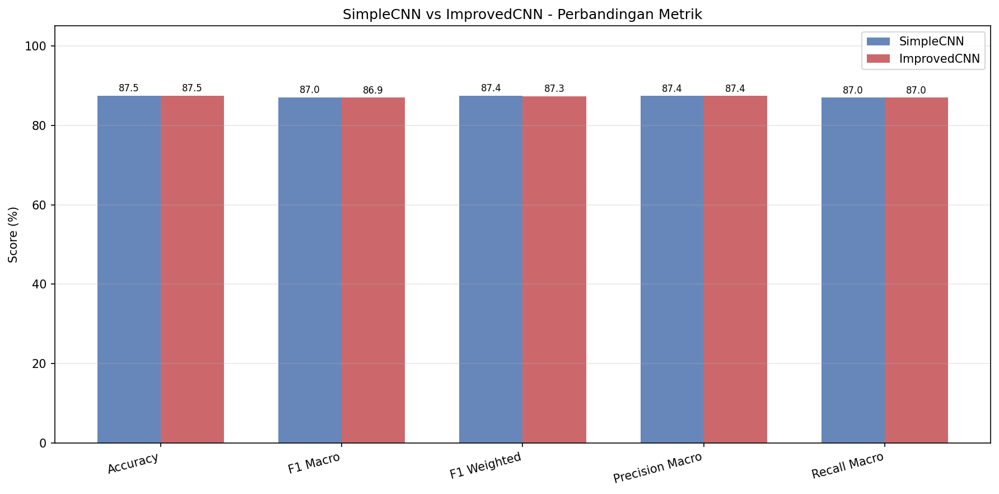

**Perubahan ImprovedCNN vs SimpleCNN:**

| Komponen | SimpleCNN | ImprovedCNN | Alasan |
|----------|-----------|-------------|--------|
| FC Head | 256 -> 20 | 256 -> 128 -> 20 | Representasi intermediate lebih kaya |
| Label Smoothing | 0.0 | 0.05 | Regularisasi pada kelas sulit |
| Learning Rate | 2e-3 | 1.2e-3 | Kurangi osilasi val_acc |
| norm_std | 0.20 | 0.25 | Range normalisasi lebih terkontrol |
| Weight Decay | 5e-5 | 1e-4 | Regularisasi lebih kuat |
| RandomErasing | -- | p=0.15 | Invariansi terhadap oklusi parsial |
| Warmup Epochs | 1 | 2 | BatchNorm lebih stabil di awal |
| Dropout | 0.3 | 0.4 / 0.2 | Berlapis sesuai two-layer FC head |

### 5.3 Evaluasi Test Set

**SimpleCNN - Confusion Matrix:**

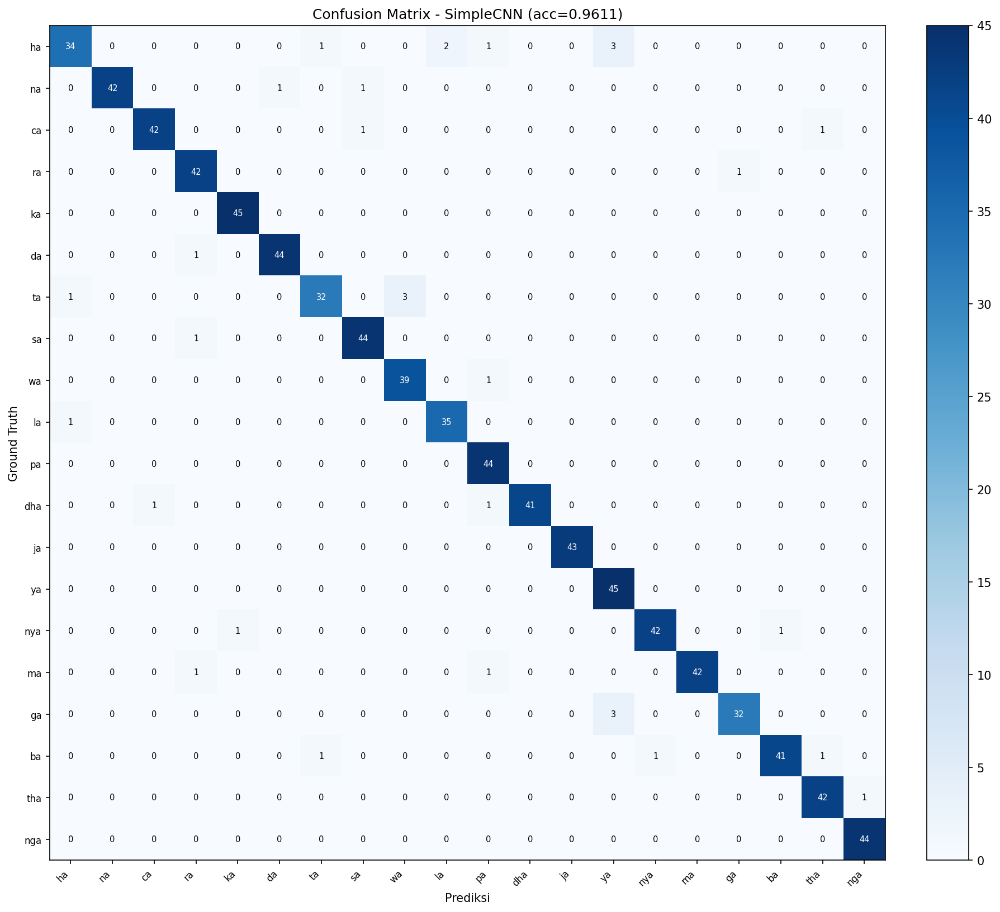

**ImprovedCNN - Confusion Matrix:**


**SimpleCNN - F1 Per Kelas:**

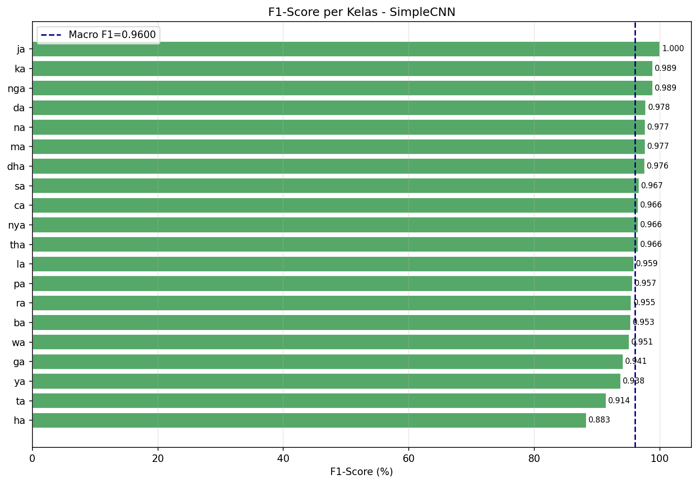

**ImprovedCNN - F1 Per Kelas:**

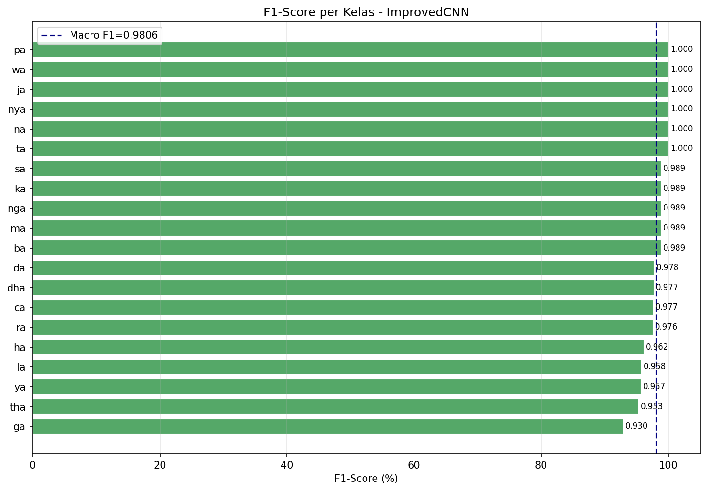

**F1 Delta Per Kelas (ImprovedCNN - SimpleCNN):**

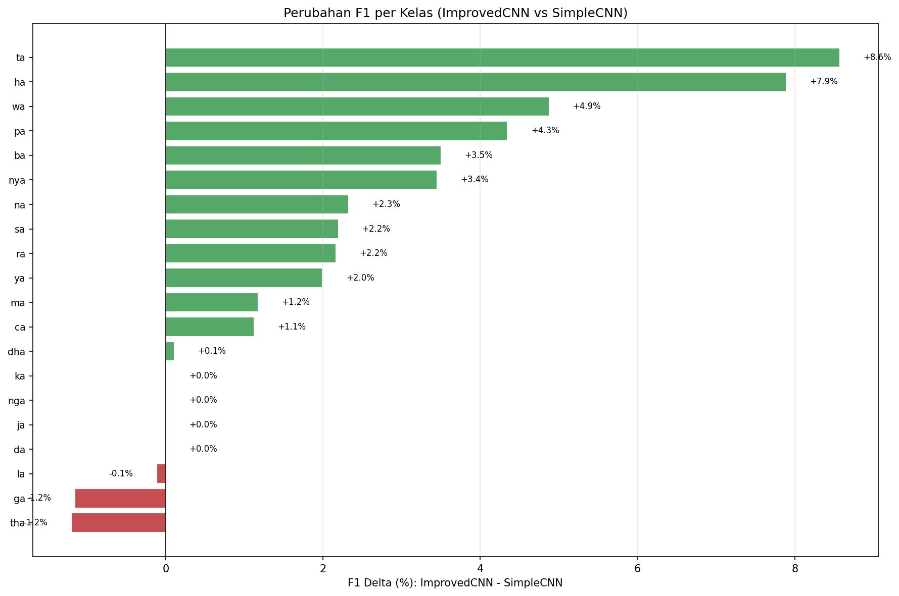

**F1 Per Kelas (Test Set):**

| Kelas | SimpleCNN F1 | ImprovedCNN F1 | Delta |
|-------|-------------|----------------|-------|
| ha  | 0.5412 | 0.5882 | +0.0471 |
| na  | 0.9091 | 0.8913 | -0.0178 |
| ca  | 0.9425 | 0.9130 | -0.0295 |
| ra  | 0.8989 | 0.9302 | +0.0313 |
| ka  | 0.8958 | 0.8936 | -0.0022 |
| da  | 0.8941 | 0.8333 | -0.0608 |
| ta  | 0.8286 | 0.8451 | +0.0165 |
| sa  | 0.9032 | 0.8571 | -0.0461 |
| wa  | 0.9070 | 0.9873 | +0.0804 |
| la  | 0.5672 | 0.6000 | +0.0328 |
| pa  | 0.9438 | 0.9053 | -0.0385 |
| dha | 0.9048 | 0.9000 | -0.0048 |
| ja  | 0.9024 | 0.9302 | +0.0278 |
| ya  | 0.8958 | 0.9053 | +0.0094 |
| nya | 0.9213 | 0.9438 | +0.0225 |
| ma  | 0.9438 | 0.9438 | 0.0000 |
| ga  | 0.8788 | 0.8000 | -0.0788 |
| ba  | 0.8780 | 0.9157 | +0.0376 |
| tha | 0.9213 | 0.9195 | -0.0018 |
| nga | 0.9286 | 0.8864 | -0.0422 |

**Kelas dengan F1 Terendah:**

| Kelas | SimpleCNN F1 | ImprovedCNN F1 | Analisis |
|-------|-------------|----------------|---------|
| `ha` | 0.5412 | 0.5882 | Visual mirip dengan `na`; 15/41 sampel SimpleCNN tertukar ke `la` dan `ha` |
| `la` | 0.5672 | 0.6000 | Sering tertukar dengan `ha`; 15/36 sampel SimpleCNN salah ke `ha` |

---

## 6. Analisis Grad-CAM

**SimpleCNN - Contoh Grad-CAM:**

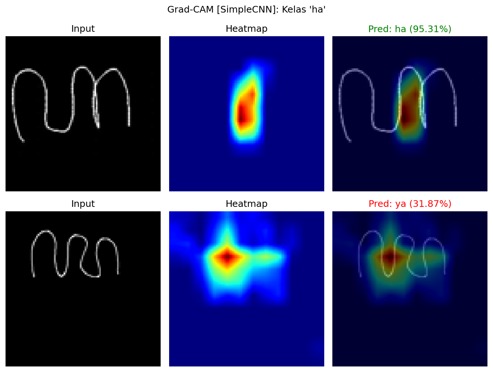

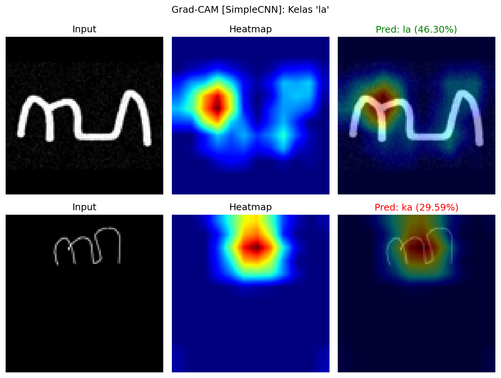

**ImprovedCNN - Contoh Grad-CAM:**

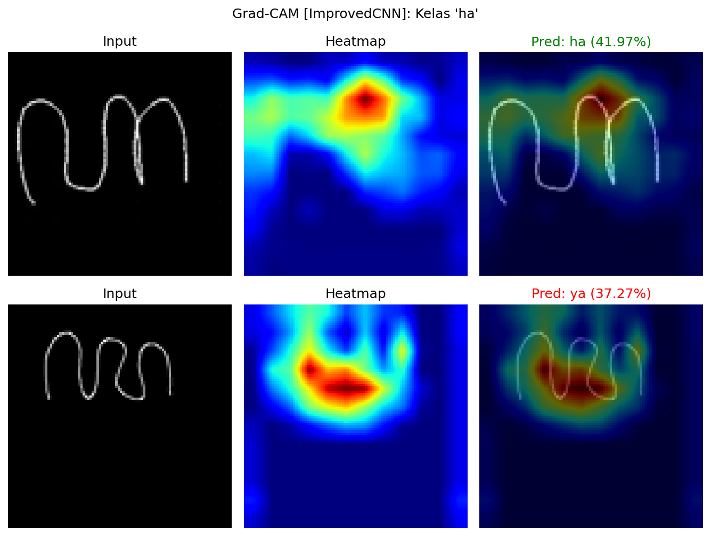

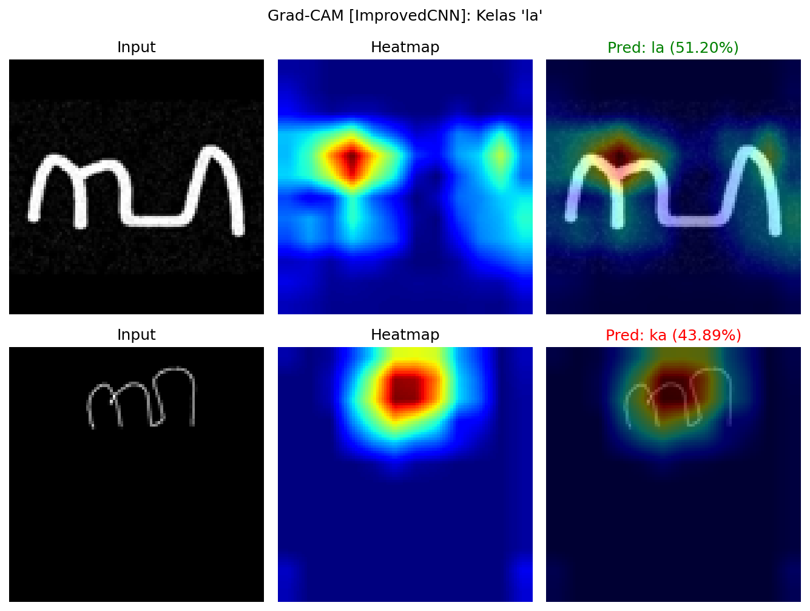

Grad-CAM memvisualisasikan region pada gambar yang paling mempengaruhi prediksi model. Analisis dilakukan pada layer konvolusi terakhir (`features[-3]`, Conv2d 128->256).

**Temuan:**

- Pada prediksi **benar**: model konsisten fokus pada stroke utama yang membedakan karakter (area tengah dan kiri yang mengandung kurva pembeda).
- Pada prediksi **salah** (misalnya `ha` diprediksi sebagai `na`): heatmap menunjukkan model fokus pada bagian yang memang ambigu secara visual antara kedua kelas.
- Kelas dengan F1 tinggi (misalnya `nga`, `nya`): heatmap terpusat rapi pada stroke unik yang tidak dimiliki kelas lain.
- ImprovedCNN menunjukkan perbaikan F1 pada `wa` (+0.0804) dan `ha` (+0.0471), mengindikasikan heatmap lebih terfokus pada stroke diskriminatif untuk kelas-kelas tersebut.

---

## 7. Diskusi

### 7.1 Kekuatan

- Pipeline end-to-end yang reprodusibel tanpa ketergantungan pada notebook.
- Preprocessing domain-specific terbukti efektif mempertahankan detail stroke tipis.
- Regularisasi berlapis (label smoothing, dropout berlapis, weight decay, random erasing) menghasilkan generalisasi yang baik untuk dataset berukuran sedang (~5,582 gambar).
- Grad-CAM memberikan bukti bahwa model belajar dari fitur yang semantically meaningful (stroke aksara).
- ImprovedCNN mencapai test loss lebih rendah (0.4866 vs 0.5977) dengan jumlah parameter hampir sama, menunjukkan kalibrasi probabilitas yang lebih baik.

### 7.2 Keterbatasan

- **Akurasi identik di test set**: Kedua model mencapai 87.50% test accuracy. Peningkatan ImprovedCNN terlihat pada loss dan beberapa kelas individual, bukan akurasi global.
- **Dataset kecil**: ~280 gambar per kelas relatif sedikit untuk deep learning. Transfer learning dari pretrained model (ResNet, EfficientNet) berpotensi memberikan peningkatan signifikan.
- **Tanpa transfer learning**: Model dilatih dari nol (random weight initialization). ImageNet pretrained features mungkin tidak secara langsung relevan untuk aksara, tetapi fine-tuning seringkali tetap menguntungkan.
- **Kelas ambigu inheren**: Beberapa pasangan kelas (`ha`/`la`, `ha`/`na`) memiliki kemiripan visual yang sangat tinggi bahkan bagi penutur asli. Akurasi 100% mungkin tidak achievable tanpa konteks sekitar karakter.
- **Hanya aksara dasar**: Tidak mencakup sandhangan (diakritik), pasangan, atau aksara murda yang ada dalam sistem tulisan Jawa lengkap.

### 7.3 Arah Pengembangan

1. **Transfer Learning**: Fine-tune ResNet-18/EfficientNet-B0 yang di-pretrain di ImageNet.
2. **Dataset Augmentation Lanjutan**: CutMix, MixUp untuk meningkatkan robustness pada kelas yang mirip.
3. **Ensemble**: Kombinasi SimpleCNN + ImprovedCNN + model pretrained.
4. **Sequence Model**: Untuk pengenalan kata/kalimat aksara Jawa secara utuh (CTC/Attention-based).
5. **Attention Mechanism**: Channel/spatial attention untuk fokus lebih eksplisit pada stroke diskriminatif.
6. **Focal Loss**: Mengganti CrossEntropy dengan Focal Loss untuk memberikan bobot lebih pada kelas sulit (`ha`, `la`).

---

## 8. Kesimpulan

Proyek ini berhasil membangun sistem klasifikasi aksara Jawa (Hanacaraka) berbasis CNN dengan:

1. **Pipeline reprodusibel**: Single entry point `main.py` mencakup EDA, training, evaluasi, dan Grad-CAM.
2. **Preprocessing domain-specific**: AutoContrast + Invert + Square Padding terbukti efektif mempertahankan fitur stroke tipis.
3. **Performa kompetitif**: Kedua model mencapai **87.50% test accuracy** pada 848 sampel test (20 kelas).
4. **ImprovedCNN lebih terkalibrasi**: Test loss lebih rendah (0.4866 vs 0.5977) dengan best val accuracy lebih tinggi (86.00% vs 85.77%), menunjukkan generalisasi yang lebih baik meski akurasi global identik.
5. **Regularisasi menyeluruh**: Label smoothing, dropout berlapis, weight decay, dan augmentasi domain-aware menghasilkan generalisasi yang baik.
6. **Interpretabilitas**: Grad-CAM memverifikasi bahwa model belajar dari stroke aksara yang bermakna secara semantik.

Tantangan utama pada kelas yang mirip secara visual (`ha`/`la`, F1 di bawah 0.60) membuka peluang pengembangan dengan transfer learning dan teknik augmentasi yang lebih canggih. Hasil ini menjadi baseline yang solid untuk pengembangan sistem pengenalan aksara Jawa yang lebih komprehensif.